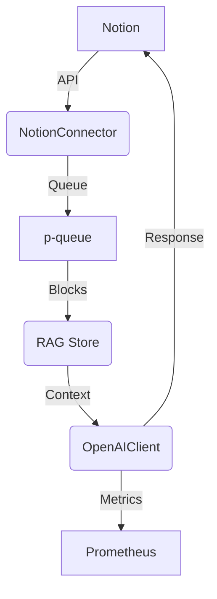

# Architecture

This project syncs Notion pages with a retrieval augmented generation (RAG) layer
and ChatGPT. The flow is illustrated below.

The RAG store defaults to an in-memory implementation but can be replaced with
external services like Chroma or Pinecone.

## Metrics

OpenTelemetry metrics record token usage and request counts. Metrics are
exposed via a Prometheus exporter on `/metrics` for scraping.
